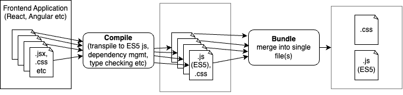
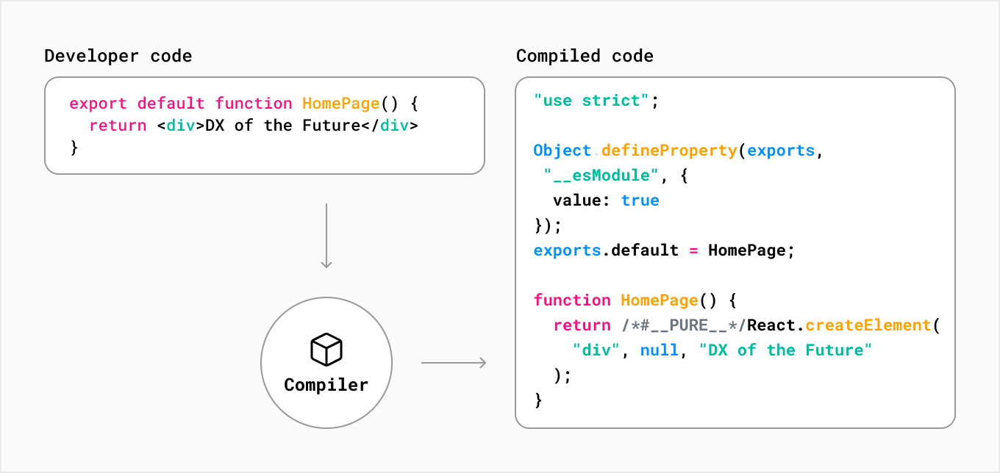
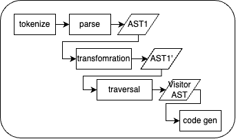
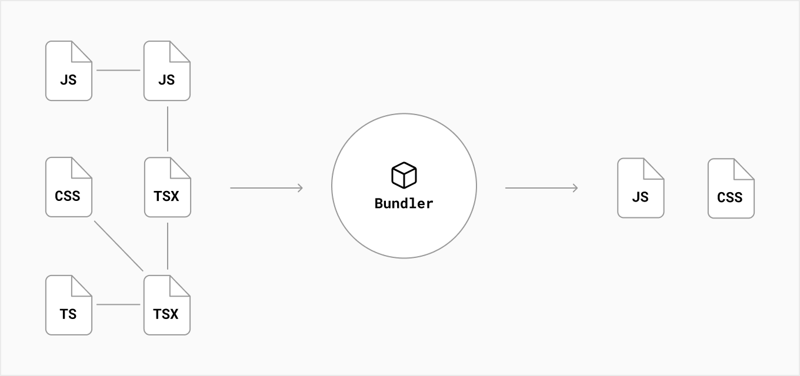
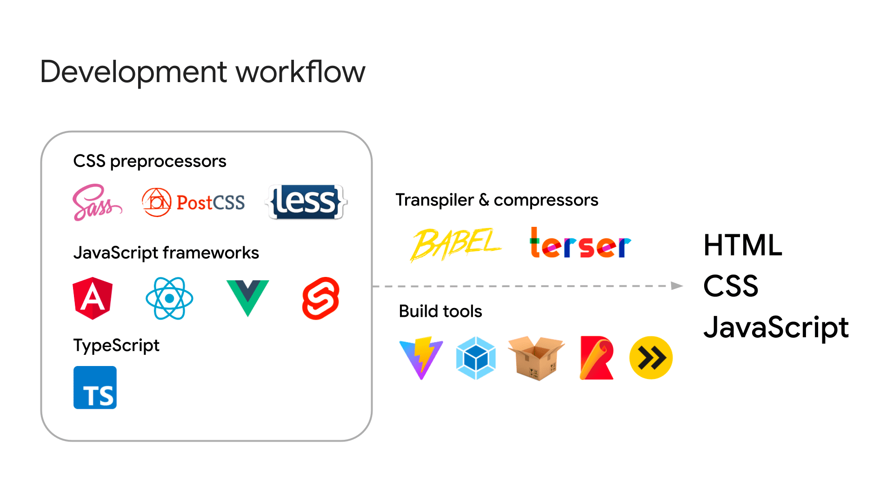
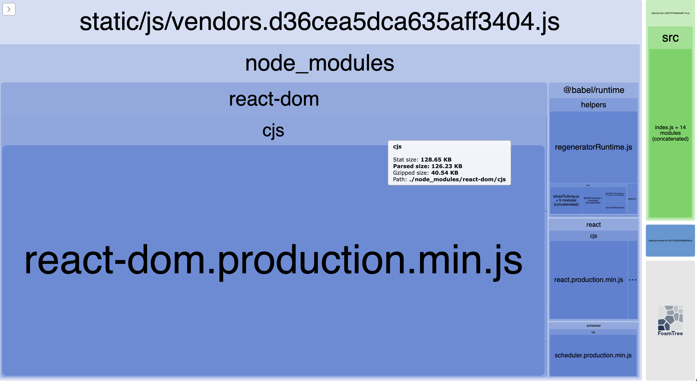

# SEDP-Flix Ground Up

Movie app using plain React.js framework to implement a movie db app.
Project created from ground up without using create-react-app.

- Based on [this project](react-css-create-react-app/README.md)

## Overview

- Using the plain react components, css for styling (no additional frameworks or libraries) from [this project](react-css-create-react-app/README.md).
- Create the project from scratch without use of tools like `create-react-app`

**This project implements**:

- [x] Build:

  - [x] `/dist`
  - [x] `index.html`
    - derived from static/templates/index.html
  - [ ] `manifest.json`
  - [ ] `robots.txt`

- Compile:

  - ES5 transpiler:
    - [x] Babel (`.babelrc`)

- Bundle:

  - [x] webpack: (`webpack.config.js`)
    - ES5 transpiler:
      - [x] `babel-loader`
    - static asset loading:
      - [x] css: (`/src/styles`)
        - `css-loader`
        - `style-loader`
      - [ ]

- Optimisations:
  - [x] url caching:
    - static file caching by hash in filename
    - bundle chunking: vendor, runtime, asset chunk splitting
  - [ ] minification:

## Typical application or site built with webpack

**Components:**

1. The source code you, and maybe your team, have written.
2. Any third-party library or "vendor" code your source is dependent on.
3. A webpack runtime and manifest that conducts the interaction of all modules.

**Runtime**:  
The runtime, along with the manifest data, is all the code webpack needs to connect your modularized application while it's running in the browser.
It contains the loading and resolving logic needed to connect your modules as they interact.
This includes connecting modules that have already been loaded into the browser as well as logic to lazy-load the ones that haven't.

**Manifest**:  
Once your application hits the browser in the form of index.html file, some bundles and a variety of other assets required by your application must be loaded and linked somehow.
As the compiler enters, resolves, and maps out your application, it keeps detailed notes on all your modules.
This collection of data is called the "Manifest," and it's what the runtime will use to resolve and load modules once they've been bundled and shipped to the browser.

**Assets**:  
Asset imports (css, files, images etc) in js files not supported by default.  
Webpack has ways to handle this.  
see: [webpack/static.html](https://vuejs-templates.github.io/webpack/static.html)

- `src/assets`: assets imported in bundled files

  - resolved by Webpack as a module dependency:
    - eg. `require('./relative/path/to/file.jpg')`
    - eg. relative import: `background: url(./logo.png)`

- `/static/...`: assets not resolved in bundled files
  - not touched by Webpack
    - eg. fonts
  - directly copied to their final destination as-is, with the same filename
  - referenced by absolute path: `assetsPublicPath + assetsSubDirectory + path/to/[filename]`
    - eg. `/static/[filename]`

### Favicons

sizes:

```
16x16: The size of browser favicons.
32x32: The size of taskbar shortcut icons.
96x96: The size of desktop shortcut icons.
180x180: The size of Apple touch icons.
300x300: The size required by Squarespace.
512x512:The size required by WordPress.
```

## Basic Build Overview



### Steps

#### Compile:

- [x] Gather resources, transpile etc
      
- [x] Compilation steps:  
      
- [x] [Babel](https://babeljs.io/): transpile React ES6 JSX -> ES5 Javascript:
  - Transform syntax
  - **Polyfill** features that are missing in your target environment
  - Source code **transformations**
  - **Preset**: instruct the babel-transpiler to transpile the file in the specified mode
- [ ] project to build a mini compiler:
  - https://github.com/jamiebuilds/the-super-tiny-compiler

#### Bundle:



- [**Common Concepts**](https://webpack.js.org/concepts/#entry):

  - [entry point](https://webpack.js.org/concepts/#entry): indicates which module webpack should use to begin building out its internal dependency graph.
  - [loaders](https://webpack.js.org/concepts/loaders/): transformations that are applied to the source code of a module.
    - eg. transpile React ES6 JSX -> ES5 Javascript
      - [babel-loader](https://webpack.js.org/loaders/babel-loader/)
    - css loaders (allow import of css)
  - [plugins](https://webpack.js.org/concepts/#plugins): perform a wider range of tasks than loaders
    - bundle optimization
    - asset management
    - injection of environment variables

- **Common Bundlers**:

  - `react-scripts build`:
    - used by create-react app
    - good for new developers learning React
    - uses webpack under the hood
    - can't be used for a project intended to provide reusable components to other applications
  - [webpack](https://webpack.github.io/):
    - general purpose
    - highly configurable
    - customisation through plugins and loaders
      - [plugins out the box](https://webpack.js.org/plugins)
      - supports all browsers that are ES5 Javascript compliant
    - steep learning curve
    - slow complex set up
    - One of webpack's specific features is the ability to import any type of module, e.g. .css files, which may not be supported by other bundlers or task runners.
  - [esbuild](https://esbuild.github.io/)
    - simpler than webpack
    - prefers convention over configuration
    - customisation through plugins and loaders (not as rich as webpack)
    - smaller ecosystem for integrations (supports major frontends like React, Vue.js eyc)

- **Optimisation** (Nice to have):
  - Minification
  - Caching
    - [webpack caching](https://webpack.js.org/guides/caching/)
    - [long term caching urls webpack](https://github.com/webpack/docs/wiki/long-term-caching)
    - [http cache](https://web.dev/articles/http-cache)
  - Prefetching?
  - [code splitting](https://nextjs.org/learn/foundations/how-nextjs-works/code-splitting)
  - [CDN and Edges](https://nextjs.org/learn/foundations/how-nextjs-works/cdns-and-edge)

## Quick start commands

1. **Install** `node_modules/` dependencies:

```bash
npm install
```

2. **Run [dev server](http://localhost:8002/)** with hot module replacement and live reload:

```bash
npm run start
```

3. **Production build** (output to `/dist`):

```bash
npm run build
```

4. **Bundle analyzer** report and production build (output to `/dist/report.html`):

```bash
npm run build:report
```

5. **Nuke** build output `/dist`:
   - _implicit in `npm run build`_

```bash
npm run clean
```

6. **Lint** using `eslint`:

```bash
npm run lint
```

## Running Locally

1. tunnel to devServer port

```bash
nngrok http 8002
```

2. set the forwarding url in your TMBD api details:

   - [https://www.themoviedb.org/settings/api/details](https://aba6-196-214-211-177.ngrok-free.app)
   - eg. https://aba6-196-214-211-177.ngrok-free.app

3. copy your [TDBM API token](https://www.themoviedb.org/settings/api) to `.env`:

```
TMDB_API_TOKEN=ey......
```

4. run the local dev server from the

```
npm run start
```

## Testing the build

1. Build the project

   ```bash
   npm run build
   ```

2. Serve the build directory

   ```bash
   npm i -g serve
   ```

   ```bash
   serve -s dist
   ```

## Building the React project from scratch

### References

- [create-react-app-without-create-react-app](https://blog.bitsrc.io/create-react-app-without-create-react-app-b0a5806a92)
- [react-webpack-example](https://github.com/wiziple/react-webpack-example/)

### Steps taken

#### Install project dependencies

1. Create project folder and package.json

   ```bash
   npm init
   ```

2. Install webpack dependencies:

   - `webpack`: the bundler
   - `webpack-cli`: cli tool for webpack
   - `webpack-dev-server`: enable us to create a localhost dev environment
   - `path`: node utils for working with system paths

   ```
   npm i --save-dev webpack
                    webpack-cli
                    webpack-dev-server
                    path
   ```

3. Install the Babel dependencies:

   - `@babel/core`: core package -` @babel/cli`: command line interface to use babel
   - `@babel/preset-env`: use the latest JavaScript without needing to micromanage which syntax transforms
   - `@babel/preset-react`: helps in converting html files to react based file
   - `@babel/plugin-transform-runtime`: enables re-use of Babel’s injected helper code to save on codesize

   ```
   npm i --save-dev babel-loader
                    @babel/preset-env
                    @babel/core
                    @babel/preset-react
                    @babel/cli
                    @babel/plugin-transform-runtime
   ```

   - `@babel/runtime`: contains a polyfill and many other things that Babel can reference

   ```bash
   npm i --save @babel/runtime
   ```

4. Install React:

   - `react`: framework js
   - `react-dom`: entry point to the DOM and server renderers for React

   ```bash
   npm i react react-dom
   ```

5. Install CSS asset loader dependencies:

   - `css-loader`: interprets @import and url() like import/require() and will resolve them
   - `style-loader`: inject CSS into the DOM.
     - injects `<style>` tag into index.js
     - good for development
   - `mini-css-extract-plugin`: extracts CSS into separate files
     - creates css files to be loaded async
     - good for production
     - some other css loaders like `sass-loader` don't play nicely with this, need to use `style-loader`
   ```
   npm i --save-dev css-loader style-loader
                    mini-css-extract-plugin
   ```

6. Install bundle minimizer plugin:

   ```
   npm i --save-dev terser-webpack-plugin
   ```

7. Install `eslint`:

   - `eslint`
   - `eslint-plugin-prettier`: Runs Prettier as an ESLint rule
   - `eslint-config-prettier`: Turns off all rules that are unnecessary or might conflict with Prettier.
   - `eslint-plugin-react`: plugin for eslint integration for react (see `.eslintrc`)

   ```
   npm i --save-dev eslint
                    eslint-plugin-react
   ```

8. Install `webpack` deps for `eslint`:

   - `eslint-webpack-plugin`: plugin using eslint to find and fix problems in your JavaScript code

   ```bash
   npm install eslint-webpack-plugin --save-dev
   ```

   - `@babel/eslint-parser`: parser that allows ESLint to run on source code that is transformed by Babel

   ```bash
   npm i --save-dev @babel/eslint-parser
   ```

9. Install `bundle analyzer`:
   ```bash
   npm install --save-dev webpack-bundle-analyzer
   ```

##### Set up the project

1. Add commands to `package.json`

   - `start`: run dev server
   - `build`: compile files into distribution folder
   - `build:report`: prod build that will generate a bundle analyzer report
   - `lint`: lint `src/` `.js`, `.jsx` using eslint
   - `clean`: rm -rf of distribution folder (i.e. dist/)

2. Create React `App.js` (application entry point)

```bash
mkdir src
$ touch src/App.js
```

3. Create template `index.html`

```bash
mkdir -p static/templates
touch static/templates/index.html
```

4. Create `index.js` (index page entry point for webpack to build out its dependecy graph)

```bash
touch src/index.js
```

5. Create `webpack.config.js`

```bash
touch webpack.config.js
```

6. Create `.babelrc`:
   - context as
   ```
   /* this is what webpack.rules.use="babel-loader" will reference */
   {
      /* plugin collections, each supporting particular language features */
      "presets": [
         "@babel/preset-env", // compile (ES2015+) latest JavaScript****
         [
            "@babel/preset-react",  // converting html files to react based files
            {"runtime": "automatic"}  // auto imports the functions that JSX transpiles to (plugin-transform-runtime overrides the classic defined in preset-react)
         ]
      ],
     /* APPLIED BEFORE "presets"; individual plugins code transformations */
     "plugins": [
       "@babel/plugin-transform-runtime"  // re-use of Babel’s injected helper code to save on codesize
     ]
   }
   ```

## Extras

### source map

- map optimised code back to source code for debugging purposes
  [https://web.dev/articles/source-maps
  ](https://web.dev/articles/source-maps)
  
- These tools require a build process to transpile your code into standard HTML, JavaScript, and CSS that browsers can understand. Additionally, to optimize performance, it's common practice to compress
- optimization can make debugging more challenging. Compressed code with everything in a single line and shorter variable names can make it difficult to pinpoint the source of an issue
- [how to use a source map](https://firefox-source-docs.mozilla.org/devtools-user/debugger/how_to/use_a_source_map/index.html)
- [chrom dev tools debug](https://developer.chrome.com/docs/devtools/javascript/source-maps/)
- compiled js will have a comment something like: `// sourceMappingURL=main.js.map`

**Example usage**

1. Run a production build with minified output:

```
npm run build
serve -s dist
```

2. Open in browser: [localhost:3000](http://localhost:3000/)
3. Open `Sources` tab
4. Select a minified file
   - eg. `runtime.5c102107e92235606046.js`
5. `Command + P`
6. Search for the original js file
   - eg. `App.js`
7. Can set breakpoints for debugging here

## Linting with `ESLint`

- With webpack: https://www.robinwieruch.de/webpack-eslint/
- eslint rules ref: https://eslint.org/docs/latest/rules/
- `.eslintrc`: config file
  - can extend shared configs eg. [eslint-config-airbnb-base](https://www.npmjs.com/package/eslint-config-airbnb-base)
- `.eslintingore`: ignore linting in these files

## Webpack Bundle Analyzer

- [webpack-bundle-analyzer](https://www.npmjs.com/package/webpack-bundle-analyzer)
- report visualizations of what’s in your webpack bundle
- important tool to keep your webpack bundle small
- makes the most sense to analyze the production bundle - is what you serve to your users

**Interpretation**

- [Reference source](https://blog.jakoblind.no/webpack-bundle-analyzer/#what-should-i-look-for-in-the-reports)
- each JS file that is generated (ie bundled files) has its own big box with a unique color
  - sub boxes are modules
- size of the box corresponds to the size of the JS file
- implemenation code is usually smallest, rest is framework
- [`tree-shakable`](https://webpack.js.org/guides/tree-shaking/): check if any large bundles can have dead code removed

**Actions**:

- `hover`: over a box you see the exact size
- `zoom`: scroll wheel

**screenshot for this project**:


### Progressive Web App (PWA)

- NOTE: This was just looked at as a sideline. Don't fully understand just yet...-
- _Primarily for mobile, desktop app installations?_

- https://web.dev/articles/add-manifest
- see: [transform-a-react-app-built-on-webpack-to-pwa](https://dev.to/chuksjoe/how-to-transform-a-react-app-built-on-webpack-to-pwa-glb)
- type of application software delivered through the web, built using common web technologies including HTML, CSS and JavaScript.
- intended to work on any platform that uses a standards-compliant browser.
- functionality:
  - working offline, push notifications, and device hardware access
  - enabling creating user experiences similar to native applications on desktop and mobile devices

#### `manifest.json`

- see: [developer.mozilla.org/Web/Manifest](https://developer.mozilla.org/en-US/docs/Web/Manifest)
- JSON file that tells the browser about your PWA and how it should behave when installed on the user's desktop or mobile device
- includes:
  - app name
  - the icons the app should use
  - URL that should be opened when the app is launched
- The manifest file is best put in the public folder where the `index.html` file can easily access it.
- Generate a Service Worker:
  - You can use this script to cache files, send a push notification or do other background tasks like updating your page for example

```json
// manifest.json
{
  "short_name": "Football Update",
  "name": "Live Football Score Update",
  "icons": [
    {
      "src": "../images/favicon.gif",
      "sizes": "64x64",
      "type": "image/gif"
    },
    {
      "src": "../images/football-logo.png",
      "type": "image/png",
      "sizes": "256x256"
    }
  ],
  "start_url": "../",
  "display": "standalone",
  "theme_color": "#27ae60",
  "background_color": "#fff"
}
```

```html
<!--index.html-->
<link rel="manifest" href="manifest/manifest.json" />
```

- **SEE DETAILS**: in browser tools `Application` tab.

## Questions

1. Is there any other transpiling should we generally consider than (jsx -> js)?
2. Webpack: Other preferred bundlers to webpack?
3. Webpack: Long term caching of urls - conventional way?
   - Is code splitting common use?
   - Tried hashing the chunks which is fine, but didnt work for code splitting.
4. Webpack: plugins - how do we know what we need? there's a billion and no clue when and which and why to use...
5. Webpack: Is it right that css-loader / style-loader for css produce a js bundle in dist/?

- I assume that this is how the transforms work to load css in js files?

6. Is manifest.json common for PWA's? When to use?
